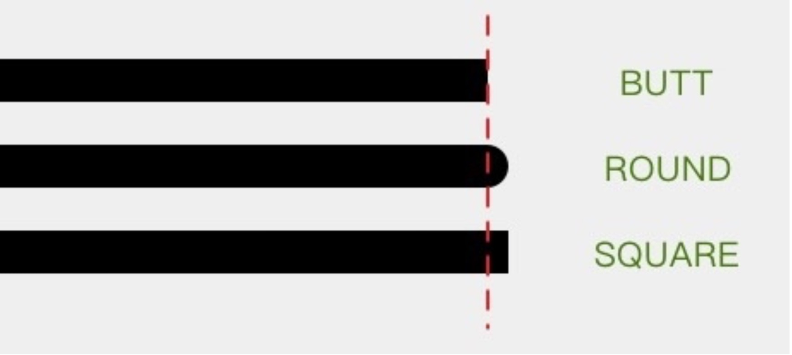

# Paint 基础

## Paint 基础 API

- `Paint.setStyle(Style style)` 设置绘制模式
- `Paint.setColor(int color)` 设置颜色
- `Paint.setStrokeWidth(float width)` 设置线条的宽度
- `Paint.setTextSize(float textSize)` 设置文字大小
- `Paint.setAntAlias(boolean aa)` 设置抗锯齿开关

### 绘制模式

`Paint.setStyle(Style style)`

`Style` 默认值为 `FILL`

- `FILL` 填充模式
- `STROKE` 画线模式（只画边缘线条）
- `FILL_AND_STROKE` 既画线又填充（可以理解为前两种模式的综合）
  
### 绘制颜色

`Paint.setColor(int color)`

`Paint.setARGB(int a, int r, int g, int b)`

两种方式用来设置绘制内容的颜色 常用第一种

### 着色器

`Paint.setShader(shader)`

可以设置一套着色方案用于绘制颜色，常用的有：

1. #### `LinearGradient` 线性渐变  
   
   构造方法：

   `LinearGradient(float x0, float y0, float x1, float y1, int color0, int color1, Shader.TileMode tile)`  

   参数：  

   `(x0,y0)` `(x1,y1)`：渐变的两个端点坐标  
   `color0` `color1`：渐变的两个端点颜色  
   `title`：渐变规则（`CLAMP`、`REPEAT`、`MIRROR` ）  

    注：渐变规则
    
    - `CLAMP`：端点之外延续端点处的颜色
    - `REPEAT`：重复模式，重复的绘制渐变对象
    - `MIRROR`：镜像模式，对称的绘制渐变对象
  
2. #### `RadialGradient` 辐射渐变
   
     构造方法：  

   `RadialGradient(float centerX, float centerY, float radius, int centerColor, int edgeColor, TileMode tileMode)`  

   参数:  

   `centerX` `centerY`：辐射渐变的中心   
   `radius`：辐射的半径  
   `centerColor`：渐变中心的颜色  
   `edgeColor`：渐变边缘的颜色  
   `titleMode`：渐变规则（`CLAMP`、`REPEAT`、`MIRROR` ）

3. #### `SweepGradient` 扫描渐变  
   
   构造方法：  

   `SweepGradient(float cx, float cy, int color0, int color1)`  

   参数：  

   `cx` `cy`：扫描的中心  

   `color0`、`color1`：扫描的开始颜色和扫描的结束颜色

4. #### `BitmapShader` 用 `Bitmap` 着色  
   
   构造方法：

    `BitmapShader(Bitmap bitmap, Shader.TileMode tileX, Shader.TileMode tileY)`  

    参数：  

    `bitmap`：着色器所用的 `bitmap` 图像  
    `titleX`、`titleY`：横向和纵向的模式

5. #### `ComposeShader` 混合着色器
  
     混合着色器就是把两个 `Shader` 一起使用  
     
     构造方法：  

     `ComposeShader(Shader shaderA, Shader shaderB, PorterDuff.Mode mode)`  

     参数：  

     `shaderA`、`shaderB`：使用的两个 `Shader`  
     `mode`：两个 `Shader` 的叠加模式 `PorterDuff.Mode` 

      `PorterDuff.Mode` 一共可以分为两大类：参考 [官方文档](https://developer.android.com/reference/android/graphics/PorterDuff.Mode)  
      
      1.Alpha 合成  
      2.混合  

     

### 设置线条的宽度

`Paint.setStrokeWidth(float width)`

默认单位为 `px` 像素

在绘制模式为 `FILL` 或者 `FILL_AND_STROKE` 下有效

### 设置文字大小

`Paint.setTextSize(float textSize)`

### 设置抗锯齿开关

`Paint.setAntiAlias(boolean aa)`

`Paint paint = new Paint(Paint.ANTI_ALIAS_FLAG)`

### 设置线端点的形状

`paint.setStrokeCap(cap)`  

`cap` 有三种类型：

- `ROUND`：圆头
- `BUTT`：平头
- `SQUARE`：方头  
  
   

  
  
   

  途中红色虚线为虚拟的，虚线的左边为黑线的实际长度，右边为不同类型下的区别